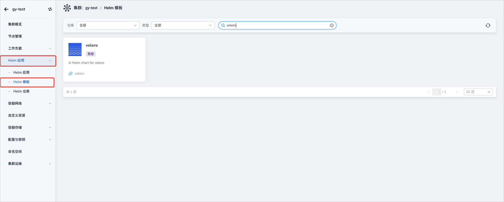
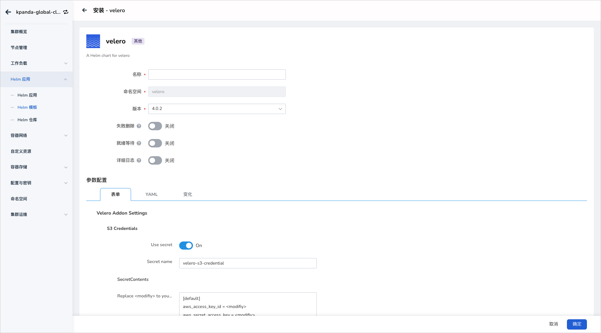

# 安装 velero 插件

velero 是一个备份和恢复 Kubernetes 集群资源的开源工具。它可以将 Kubernetes
集群中的资源备份到云存储服务、本地存储或其他位置，并且可以在需要时将这些资源恢复到同一或不同的集群中。

本节介绍如何在算丰 AI 算力平台中使用 __Helm 应用__ 部署 velero 插件。

## 前提条件

安装 __velero__ 插件前，需要满足以下前提条件：

- 容器管理模块[已接入 Kubernetes 集群](../clusters/integrate-cluster.md)或者[已创建 Kubernetes 集群](../clusters/create-cluster.md)，且能够访问集群的 UI 界面。

- 创建 __velero__ [命名空间](../namespaces/createns.md)。

- 当前操作用户应具有 [NS Editor](../permissions/permission-brief.md#ns-editor) 或更高权限，详情可参考[命名空间授权](../namespaces/createns.md)。

## 操作步骤

请执行如下步骤为集群安装 __velero__ 插件。

1. 在集群列表页面找到需要安装 __velero__ 插件的目标集群，点击集群名称，在左侧导航栏依次点击 __Helm 应用__ -> __Helm 模板__ ，在搜索栏输入 __velero__ 进行搜索。

    

1. 阅读 __velero__ 插件相关介绍，选择版本后点击 __安装__ 按钮。本文将以 __4.0.2__ 版本为例进行安装，推荐安装 __4.0.2__ 或更高版本。

    

1. 填写和配置参数后点击 __下一步__

    === "基本参数"

        

        - 名称：必填参数，输入插件名称，请注意名称最长 63 个字符，只能包含小写字母、数字及分隔符（“-”）,且必须以小写字母或数字开头及结尾，例如 metrics-server-01。
        - 命名空间：插件安装的命名空间，默认为 __velero__ 命名空间。
        - 版本：插件的版本，此处以 __4.0.2__ 版本为例。
        - 就绪等待：可选参数，启用后，将等待应用下所有关联资源处于就绪状态，才会标记应用安装成功。
        - 失败删除：可选参数，开启后，将默认同步开启就绪等待。如果安装失败，将删除安装相关资源。
        - 详情日志：可选参数，开启后将输出安装过程的详细日志。

        !!! note

            开启 __就绪等待__ 和/或 __失败删除__ 后，应用需要经过较长时间才会被标记为 __运行中__ 状态。

    === "参数配置"

        - S3 Credentials：

            - __Use secret__ ：保持默认配置 __true__ 。
            - __Secret name__ ：保持默认配置 __velero-s3-credential__ 。
            - __SecretContents.aws_access_key_id = <modifiy>__ ：配置访问对象存储的用户名，替换 __<modifiy>__ 为真实参数。
            - __SecretContents.aws_secret_access_key = <modifiy>__ ：配置访问对象存储的密码，替换 __<modifiy>__ 为真实参数。

                ```config "SecretContents 样例"
                [default]
                aws_access_key_id = minio
                aws_secret_access_key = minio123
                ```

        - Velero Configuration：

            - __Backupstoragelocation__ ：velero 备份数据存储的位置
            - __S3 bucket__ ：用于保存备份数据的存储桶名称(需为 minio 已经存在的真实存储桶)
            - __Is default BackupStorage__ ：保持默认配置 __true__
            - __S3 access mode__ ：velero 对数据的访问模式，可以选择
                - __ReadWrite__ ：允许 velero 读写备份数据
                - __ReadOnly__ ：允许 velero 读取备份数据，不能修改备份数据
                - __WriteOnly__ ：只允许 velero 写入备份数据，不能读取备份数据
            - __S3 Configs__ ：S3 存储（minio）的详细配置
            - __S3 region__ ：云存储的地理区域。默认使用 __us-east-1__ 参数，由系统管理员提供
            - __S3 force path style__ ：保持默认配置 __true__
            - __S3 server URL__ ：对象存储（minio）的控制台访问地址，minio 一般提供了 UI 访问和控制台访问两个服务，此处请使用控制台访问的地址

            !!! note

                请确保 s3 存储服务时间跟备份还原集群时间差在10分钟以内，最好是时间保持同步，否则将无法执行备份操作。

        - migration plugin configuration：启用之后，将在下一步的 YAML 代码段中新增：

            ```yaml
            ...
            initContainers:
              - image: 'release.daocloud.io/kcoral/velero-plugin-for-migration:v0.3.0'
                imagePullPolicy: IfNotPresent
                name: velero-plugin-for-migration
                volumeMounts:
                  - mountPath: /target
                    name: plugins
              - image: 'docker.m.daocloud.io/velero/velero-plugin-for-csi:v0.7.0'
                imagePullPolicy: IfNotPresent
                name: velero-plugin-for-csi
                volumeMounts:
                  - mountPath: /target
                    name: plugins
              - image: 'docker.m.daocloud.io/velero/velero-plugin-for-aws:v1.9.0'
                imagePullPolicy: IfNotPresent
                name: velero-plugin-for-aws
                volumeMounts:
                  - mountPath: /target
                    name: plugins
            ...
            ```

1. 确认 YAML 无误后点击 __确定__ ，完成 __velero__ 插件的安装。
   之后系统将自动跳转至 __Helm 应用__ 列表页面，稍等几分钟后，为页面执行刷新操作，即可看到刚刚安装的应用。
