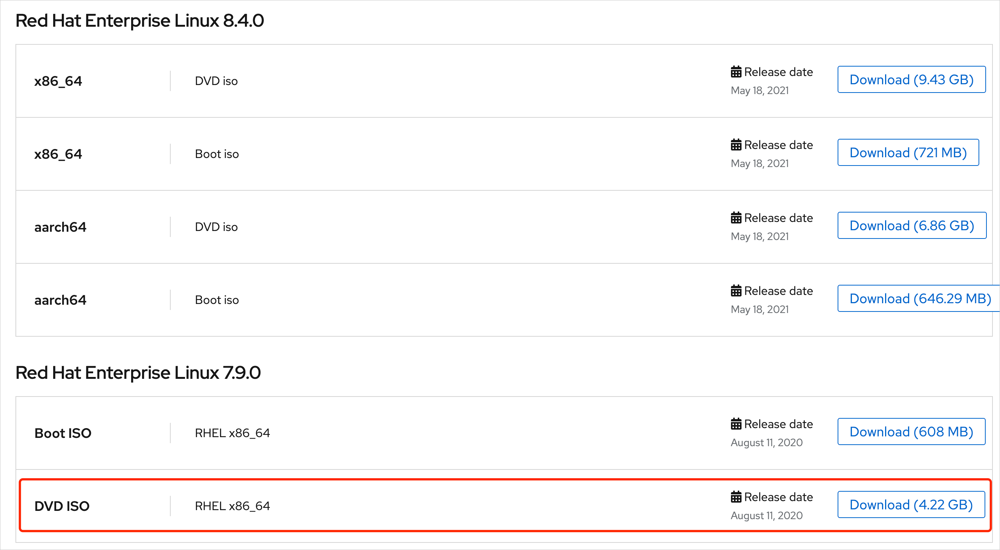
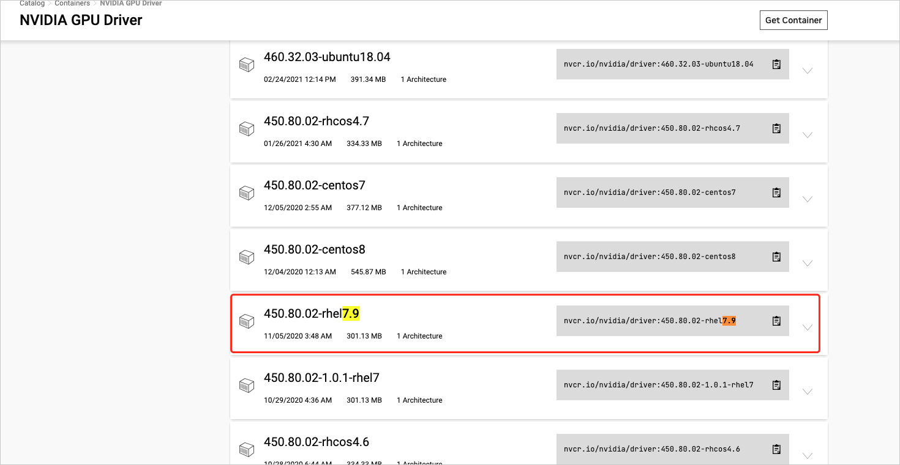

# 构建 Red Hat 7.9 离线 yum 源

## 使用场景介绍

算丰 AI 算力平台预置了 CentOS 7.9，内核为 3.10.0-1160 的 GPU Operator 离线包。其它 OS 类型的节点或内核需要用户手动构建离线 yum 源。

本文介绍如何基于全局服务集群任意节点构建 Red Hat 7.9 离线 yum 源包，并在安装 Gpu Operator 时使用 `RepoConfig.ConfigMapName` 参数。

## 前提条件
  
1. 待部署 GPU Operator 的集群节点 OS 必须为 Red Hat 7.9，且内核版本完全一致
1. 准备一个能够与待部署 GPU Operator 的集群网络联通的文件服务器，如 nginx 或 minio
1. 准备一个能够访问互联网、待部署 GPU Operator 的集群和文件服务器的节点，
   且节点上已经完成 Docker 的安装
1. 全局服务集群的节点必须为 Red Hat 7.9

## 操作步骤

### 1. 构建相关内核版本的离线 Yum 源

1. [下载 rhel7.9 ISO](https://developers.redhat.com/products/rhel/download#assembly-field-downloads-page-content-61451)

    

2. 下载与 Kubean 版本对应的的 [rhel7.9 ospackage](https://github.com/kubean-io/kubean/releases)

    在 **容器管理** 的全局服务集群中找到 **Helm 应用** ，搜索 kubean，可查看 kubean 的版本号。

    

    在 [kubean的代码仓库](https://github.com/kubean-io/kubean/releases) 中下载该版本的 rhel7.9 ospackage。

    

3. 通过安装器导入离线资源

    参考[导入离线资源文档](../../../../install/import.md)。

### 2. 下载 Red Hat 7.9 OS 的离线驱动镜像

[点击查看下载地址](https://catalog.ngc.nvidia.com/orgs/nvidia/containers/driver/tags)。



### 3. 向火种节点仓库上传 Red Hat GPU Opreator 离线镜像

参考[向火种节点仓库上传 Red Hat GPU Opreator 离线镜像](./push_image_to_repo.md)。

!!! note

    此参考以 rhel8.4 为例，请注意修改成 rhel7.9。

### 4. 在集群创建配置项用来保存 Yum 源信息
  
在待部署 GPU Operator 集群的控制节点上运行以下命令。
  
1. 执行如下命令创建名为 __CentOS-Base.repo__ 的文件，用来指定 yum 源存储的配置信息。
  
    ```bash
    # 文件名称必须为 CentOS-Base.repo，否则安装 gpu-operator 时无法被识别
    cat > CentOS-Base.repo <<  EOF
    [extension-0]
    baseurl = http://10.5.14.200:9000/centos-base/centos-base # 火种节点的的文件服务器地址，一般为{火种节点 IP} + {9000 端口}
    gpgcheck = 0
    name = kubean extension 0
    
    [extension-1]
    baseurl = http://10.5.14.200:9000/centos-base/centos-base # 火种节点的的文件服务器地址，一般为{火种节点 IP} + {9000 端口}
    gpgcheck = 0
    name = kubean extension 1
    EOF
    ```
  
2. 基于创建的 __CentOS-Base.repo__ 文件，在 gpu-operator 命名空间下，创建名为 __local-repo-config__ 的配置文件：
  
    ```bash
    kubectl create configmap local-repo-config -n gpu-operator --from-file=CentOS-Base.repo=/etc/yum.repos.d/extension.repo
    ```
      
    预期输出如下：
      
    ```console
    configmap/local-repo-config created
    ```
      
    __local-repo-config__ 配置文件用于在安装 gpu-operator 时，提供 `RepoConfig.ConfigMapName` 参数的值，配置文件名称用户可自定义。
  
3. 查看 __local-repo-config__ 的配置文件的内容：
  
    ```bash
    kubectl get configmap local-repo-config -n gpu-operator -oyaml
    ```
      
    预期输出如下：
      
    ```yaml title="local-repo-config.yaml"
    apiVersion: v1
    data:
      CentOS-Base.repo: "[extension-0]\nbaseurl = http://10.6.232.5:32618/centos-base # 步骤 2 中，放置 yum 源的文件服务器路径 \ngpgcheck = 0\nname = kubean extension 0\n  \n[extension-1]\nbaseurl
      = http://10.6.232.5:32618/centos-base # 步骤 2 中，放置 yum 源的文件服务器路径 \ngpgcheck = 0\nname
      = kubean extension 1\n"
    kind: ConfigMap
    metadata:
      creationTimestamp: "2023-10-18T01:59:02Z"
      name: local-repo-config
      namespace: gpu-operator
      resourceVersion: "59445080"
      uid: c5f0ebab-046f-442c-b932-f9003e014387
    ```
  
至此，您已成功为待部署 GPU Operator 的集群创建了离线 yum 源配置文件。
其中在[离线安装 GPU Operator](./install_nvidia_driver_of_operator.md) 时使用了 `RepoConfig.ConfigMapName` 参数。
