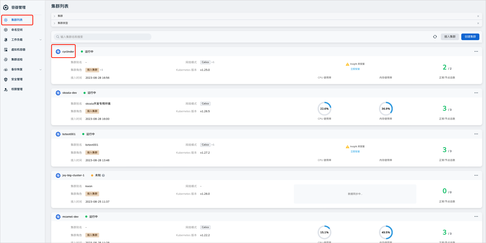
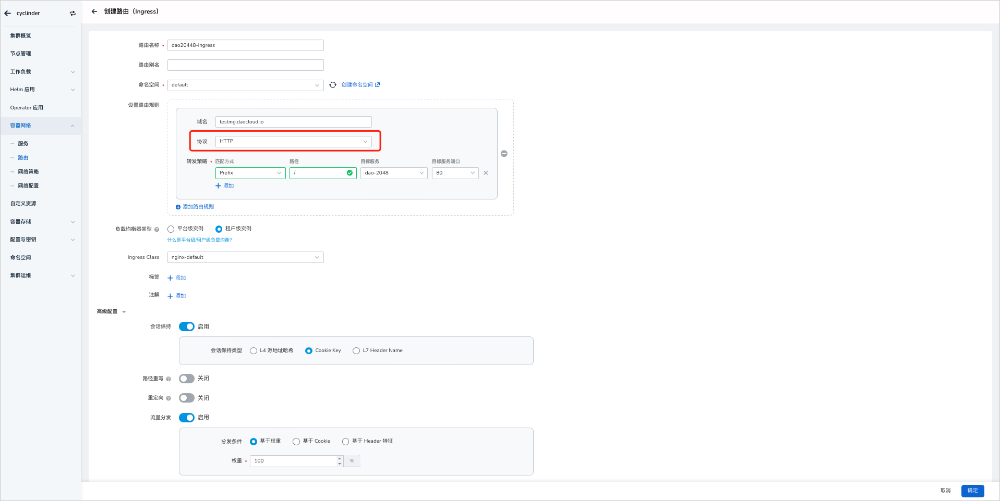
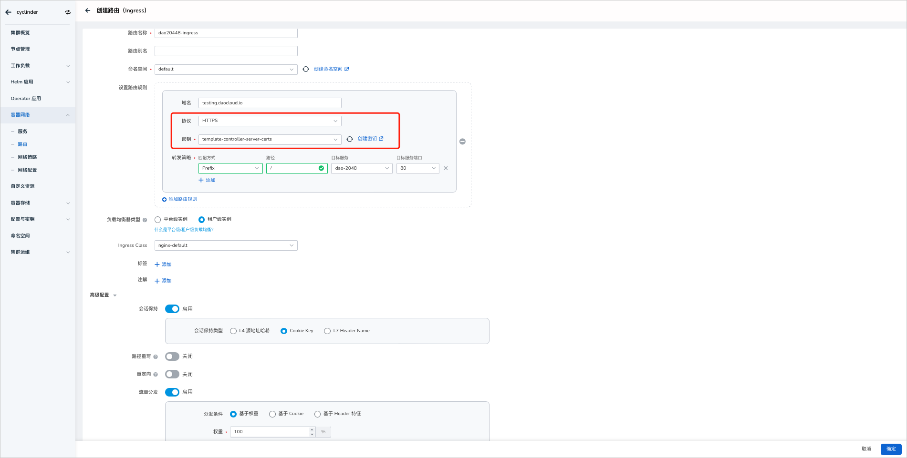

# 创建路由（Ingress）

在 Kubernetes 集群中，[Ingress](https://kubernetes.io/docs/reference/generated/kubernetes-api/v1.24/#ingress-v1beta1-networking-k8s-io) 公开从集群外部到集群内服务的 HTTP 和 HTTPS 路由。
流量路由由 Ingress 资源上定义的规则控制。下面是一个将所有流量都发送到同一 Service 的简单 Ingress 示例：

Ingress 是对集群中服务的外部访问进行管理的 API 对象，典型的访问方式是 HTTP。Ingress 可以提供负载均衡、SSL 终结和基于名称的虚拟托管。

## 前提条件

- 容器管理模块[已接入 Kubernetes 集群](../clusters/integrate-cluster.md)或者[已创建 Kubernetes](../clusters/create-cluster.md)，且能够访问集群的 UI 界面。
- 已完成一个[命名空间的创建](../namespaces/createns.md)、[用户的创建](../../register/index.md)，并将用户授权为 [NS Editor](../permissions/permission-brief.md#ns-editor) 角色 ，详情可参考[命名空间授权](../permissions/cluster-ns-auth.md)。
- 已经完成 Ingress 实例的创建，已[部署应用工作负载](../workloads/create-deployment.md)，并且已[创建对应 Service](create-services.md)
- 单个实例中有多个容器时，请确保容器使用的端口不冲突，否则部署会失效。

## 创建路由

1. 以 __NS Editor__ 用户成功登录后，点击左上角的 __集群列表__ 进入 __集群列表__ 页面。在集群列表中，点击一个集群名称。

    

2. 在左侧导航栏中，点击 __容器网络__ -> __路由__ 进入服务列表，点击右上角 __创建路由__ 按钮。

    

    !!! note

        也可以通过 __YAML 创建__ 一个路由。

3. 打开 __创建路由__ 页面，进行配置。可选择两种协议类型，参考以下两个参数表进行配置。

### 创建 HTTP 协议路由

输入如下参数：

| 参数 | 必填/选填 | 描述 |
|-----|----------|-----|
| 路由名称 | 必填 | 输入新建路由的名称。 |
| 命名空间 | 必填 | 选择新建服务所在的命名空间。关于命名空间更多信息请参考命名空间概述。 |
| **设置路由规则** | | |
| - 域名 | 必填 | 使用域名对外提供访问服务。默认为集群的域名。 |
| - 协议 | 必填 | 指授权入站到达集群服务的协议，支持 HTTP（不需要身份认证）或 HTTPS（需配置身份认证）。 |
| - 转发策略 | 选填 | 指定 Ingress 的访问策略 |
| - 路径 | 选填 | 指定服务访问的 URL 路径，默认为根路径。 |
| - 目标服务 | 必填 | 进行路由的服务名称。 |
| - 目标服务端口 | 必填 | 服务对外暴露的端口。 |
| **负载均衡器类型** | 必填 | Ingress 实例的使用范围 |
| - 平台级负载均衡器 | 必填 | 同一个集群内，共享同一个 Ingress 实例，其中 Pod 都可以接收到由该负载均衡分发的请求。 |
| - 租户级负载均衡器 | 必填 | 租户负载均衡器，Ingress 实例独属于当前命名空间，或者独属于某一工作空间。 |
| **Ingress Class** | 选填 | 选择对应的 Ingress 实例，选择后将流量导入到指定的 Ingress 实例。 |
| - 默认 Class | 选填 | 为 None 时使用默认的 DefaultClass，请在创建 Ingress 实例时设置 DefaultClass。 |
| - 其他实例 | 选填 | 若选择其他实例（如 ngnix），则会出现高级配置，可设置会话保持、路径重写、重定向和流量分发。 |
| **会话保持** | 选填 | 会话保持分为三种类型：L4 源地址哈希、Cookie Key、L7 Header Name。 |
| - L4 源地址哈希 | 选填 | 开启后默认在 Annotation 中加入标签：`nginx.ingress.kubernetes.io/upstream-hash-by: "$binary_remote_addr"` |
| - Cookie Key | 选填 | 开启后来自特定客户端的连接将传递至相同 Pod，默认在 Annotation 中增加如下参数：`nginx.ingress.kubernetes.io/affinity: "cookie"`。 |
| - L7 Header Name | 选填 | 开启后默认在 Annotation 中加入标签：`nginx.ingress.kubernetes.io/upstream-hash-by: "$http_x_forwarded_for"` |
| 路径重写 | 选填 | `rewrite-target`，某些场景中后端服务暴露的 URL 与 Ingress 规则中指定的路径不同，需要进行 URL 重写配置。 |
| 重定向 | 选填 | `permanent-redirect`，永久重定向，输入重写路径后，访问路径重定向至设置的地址。 |
| **流量分发** | 选填 | 开启后并设置后，根据设定条件进行流量分发。 |
| - 基于权重 | 选填 | 设定权重后，在创建的 Ingress 添加 Annotation：`nginx.ingress.kubernetes.io/canary-weight: "10"` |
| - 基于 Cookie | 选填 | 设定 Cookie 规则后，流量根据设定的 Cookie 条件进行流量分发。 |
| - 基于 Header | 选填 | 设定 Header 规则后，流量根据设定的 Header 条件进行流量分发。 |
| 标签 | 选填 | 为路由添加标签。 |
| 注解 | 选填 | 为路由添加注解。 |

### 创建 HTTPS 协议路由

输入如下参数：

!!! note

    注意：与 HTTP 协议 __设置路由规则__ 不同，增加密钥选择证书，其他基本一致。

- __协议__ ：必填指授权入站到达集群服务的协议，支持 HTTP （不需要身份认证）或 HTTPS（需需要配置身份认证） 协议。这里选择 HTTPS 协议的路由。
- __密钥__ ：必填，Https TLS 证书，[创建秘钥](../configmaps-secrets/create-secret.md)。

### 完成路由创建

配置完所有参数后，点击 __确定__ 按钮，自动返回路由列表。在列表右侧，点击 __┇__ ，可以修改或删除所选路由。

