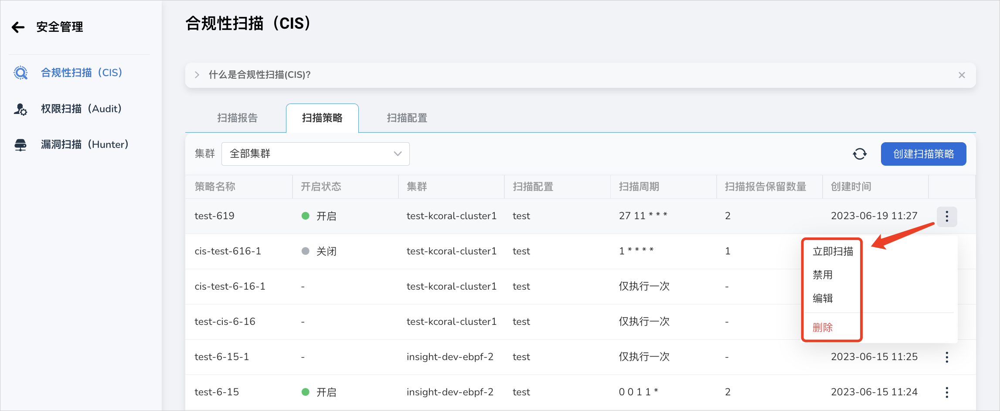

# 扫描策略

## 创建扫描策略

[创建扫描配置](config.md)之后，可以基于配置创建扫描策略。

1. 在 __安全管理__ -> __合规性扫描__ 页面的 __扫描策略__ 页签下，在右侧点击创建扫描策略。

    

2. 参考下列说明填写配置后，点击 __确定__ 。

    - 集群：选择需要扫描哪个集群。可选的集群列表来自容器管理模块中接入或创建的集群。如果没有想选的集群，可以去容器管理模块中[接入](../../clusters/integrate-cluster.md)或[创建](../../clusters/create-cluster.md)集群。
    - 扫描配置：选择事先创建好的扫描配置。扫描配置规定了需要执行哪些具体的扫描项。
    - 扫描类型：

        - 立即扫描：在扫描策略创建好之后立即执行一次扫描，后续不可以自动/手动再次执行扫描。
        - 定时扫描：通过设置扫描周期，自动按时重复执行扫描。

    - 扫描报告保留数量：设置最多保留多少扫描报告。超过指定的保留数量时，从最早的报告开始删除。

        

## 更新/删除扫描策略

创建扫描策略之后，可以根据需要更新或删除扫描策略。

在 __扫描策略__ 页签下，点击配置右侧的 __┇__ 操作按钮：

- 对于周期性的扫描策略：

    - 选择 __立即执行__ 意味着，在周期计划之外立即再扫描一次集群
    - 选择 __禁用__ 会中断扫描计划，直到点击 __启用__ 才可以继续根据周期计划执行该扫描策略。
    - 选择 __编辑__ 可以更新配置，支持更新扫描配置、类型、扫描周期、报告保留数量，不可更改配置名称和需要扫描的目标集群。
    - 选择 __删除__ 可以删除该配置

- 对于一次性的扫描策略：仅支持 __删除__ 操作。

    
