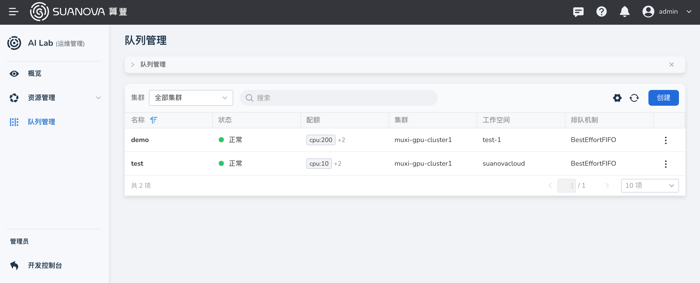
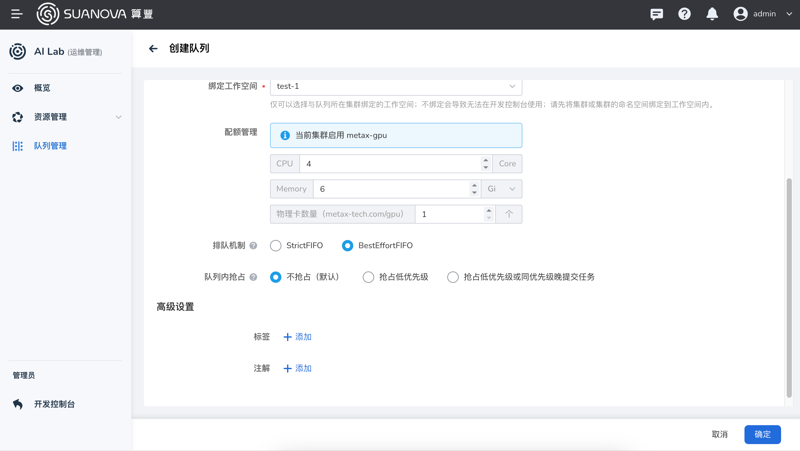
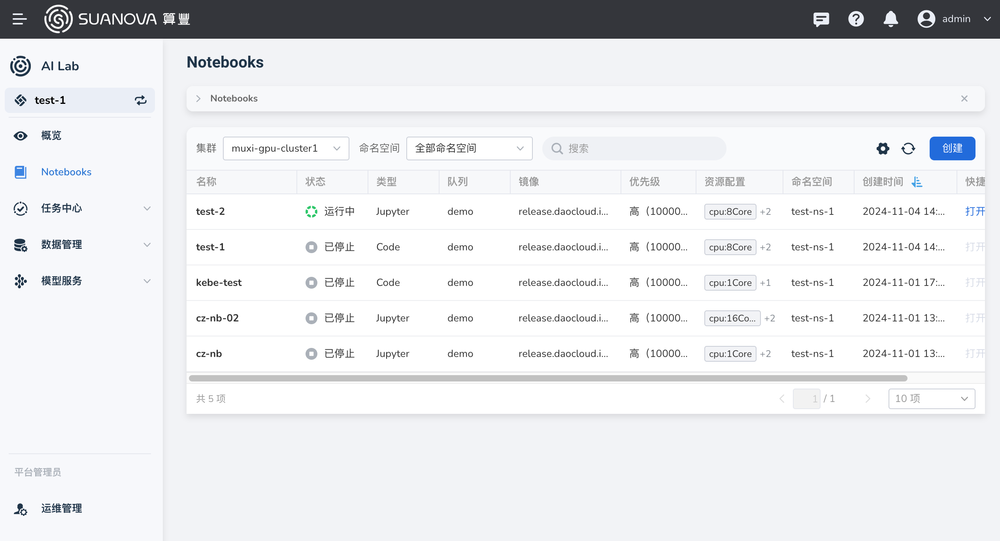
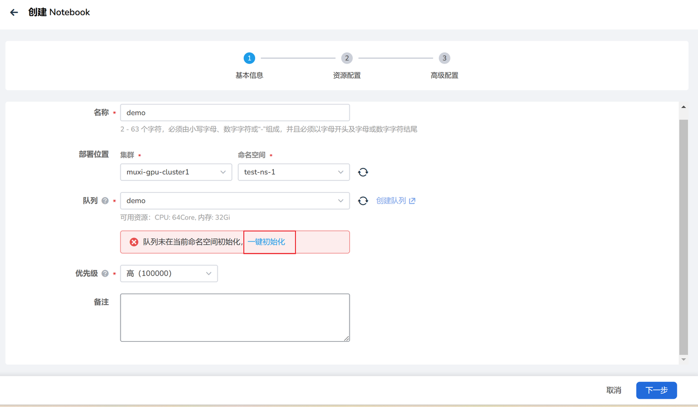
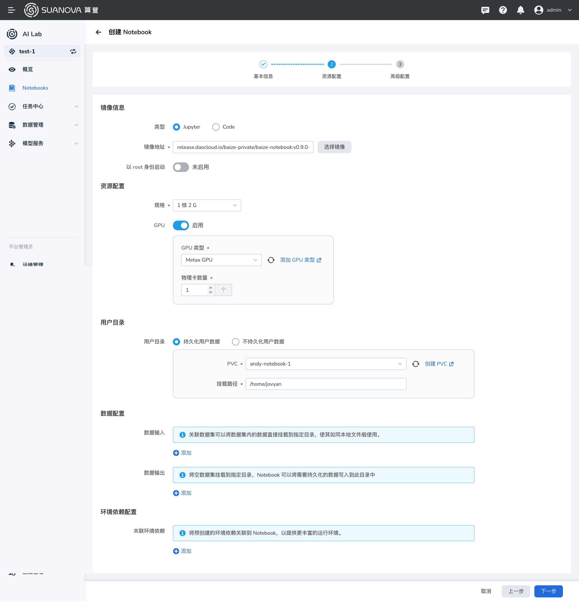
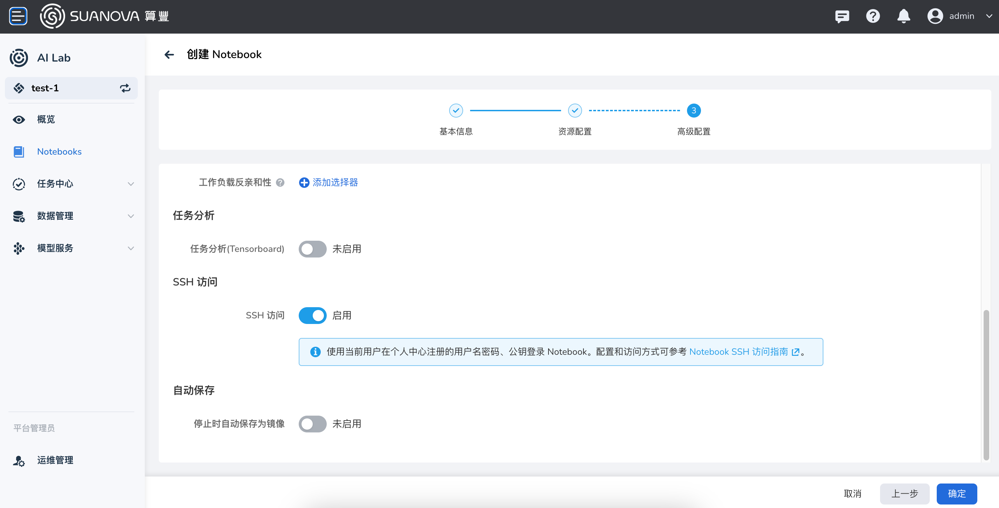
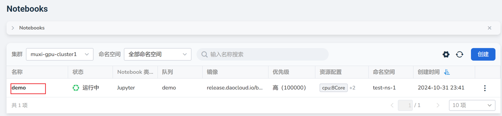
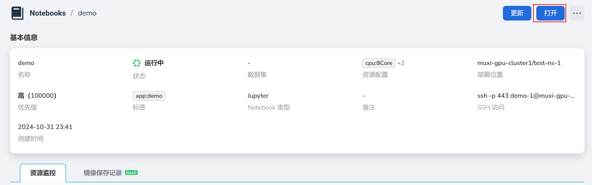
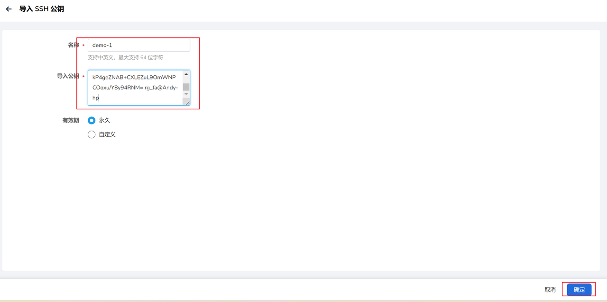
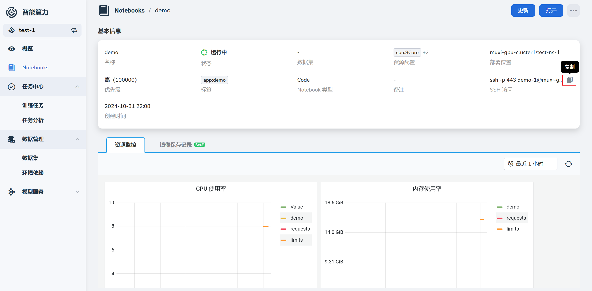

# 使用 Notebook

Notebook 通常指的是 Jupyter Notebook 或类似的交互式计算环境。
这是一种非常流行的工具，广泛用于数据科学、机器学习和深度学习等领域。
本页说明如何在算丰 AI 算力平台中使用 Notebook。

## 前置条件

- 已安装 AI 算力平台
- [用户已成功注册](../register/index.md)
- 管理员为用户分配了工作空间
- 已准备好数据集（代码、数据等）

## 创建和使用 Notebook 实例

1. 以 **管理员身份** 登录 AI 算力平台
1. 导航至 **AI Lab** -> **运维管理** -> **队列管理** ，点击右侧的 **创建** 按钮

    

1. 键入名称，选择集群、工作空间和配额后，点击 **确定**

    

1. 以 **用户身份** 登录 AI 算力平台，导航至 **AI Lab** -> **Notebook** ，点击右侧的 **创建** 按钮

    

1. 配置各项参数后点击 **确定**

    === "基本信息"

        键入名称，选择集群、命名空间，选择刚创建的队列，点击 **一键初始化**

        

    === "资源配置"

        选择 Notebook 类型，配置内存、CPU，开启 GPU，创建和配置 PVC：

        

    === "高级配置"

        开启 SSH 外网访问：

        

1. 自动跳转到 Notebook 实例列表，点击实例名称

    

1. 进入 Notebook 实例详情页，点击右上角的 **打开** 按钮

    

1. 进入了 Notebook 开发环境，比如在 `/home/jovyan` 目录挂载了持久卷，可以通过 git 克隆代码，通过 SSH 连接后上传数据等。

    

## 通过 SSH 访问 Notebook 实例

1. 在自己的电脑上生成 SSH 密钥对

    在自己电脑上打开命令行，比如在 Windows 上打开 git bash，输入 `ssh-keygen.exe -t rsa`，然后一路回车。

    

1. 通过 `cat ~/.ssh/id_rsa.pub` 等命令查看并复制公钥

    

1. 以用户身份登录 AI 算力平台，在右上角点击 **个人中心** -> **SSH 公钥** -> **导入 SSH 公钥**

    

1. 进入 Notebook 实例的详情页，复制 SSH 的链接

    

1. 在客户端使用 SSH 访问 Notebook 实例

    

下一步：[创建训练任务](../../admin/baize/developer/jobs/create.md)
