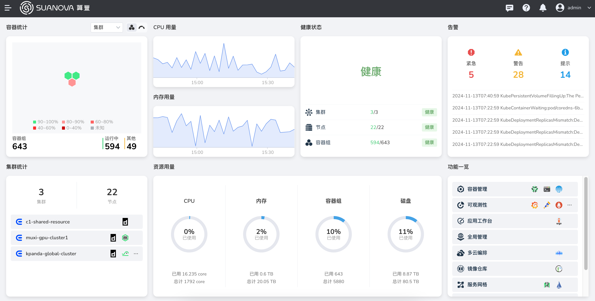

---
hide:
  - toc
  - navigation
---

# 豐收二號檔案站

這是豐收二號 AI 算力中心的檔案站。

- [終端用戶手冊](./end-user/index.md)：在容器化環境中，使用雲主機，開發 AI 算法，構建訓練和推理任務
- [管理員手冊](./admin/index.md)：為容器化終端用戶做好運維工作，保障平台平穩高效運行
- [開發者手冊](./openapi/index.md)：匯總了 5 個模塊的 OpenAPI 手冊

