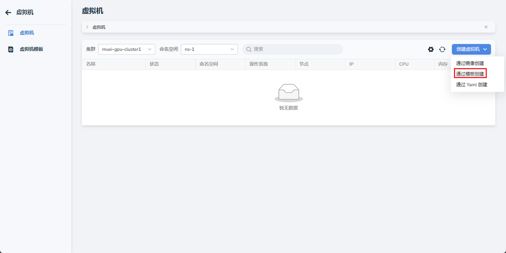
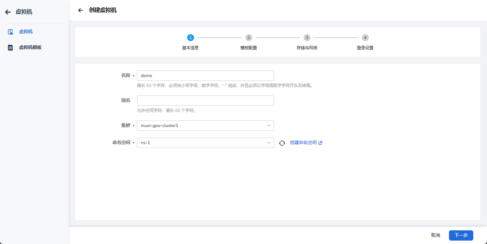
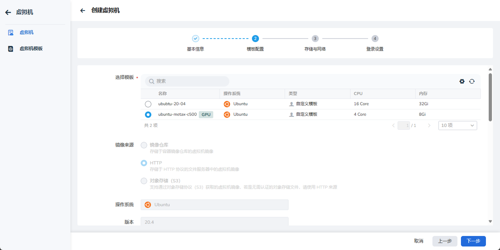
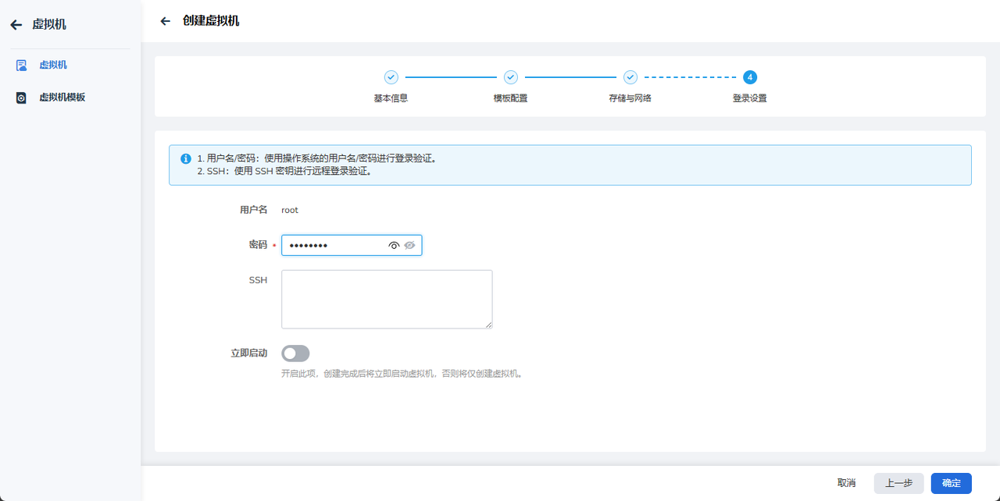
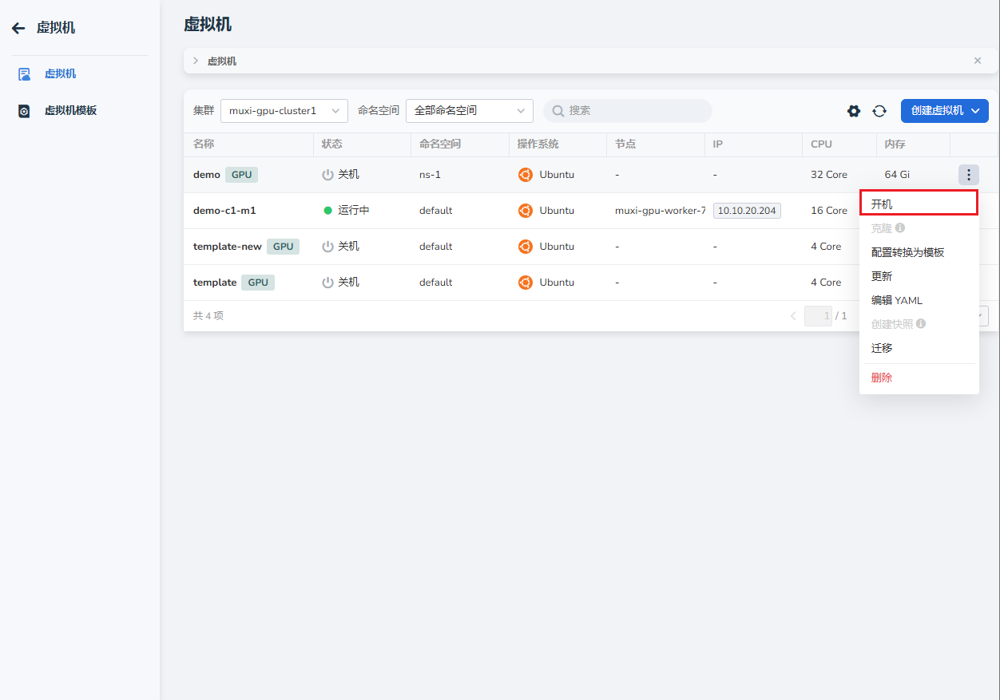

# 创建和启动云主机

用户完成注册，为其分配了工作空间、命名空间和资源后，即可以创建并启动云主机。

## 前置条件

- 已安装 AI 算力平台
- [用户已成功注册](../register/index.md)
- [为用户绑定了工作空间](../register/bindws.md)
- [为工作空间分配了资源](../register/wsres.md)

## 操作步骤

1. 用户登录 AI 算力平台
1. 点击 **创建云主机** -> **通过模板创建**

    

1. 定义的云主机各项配置后点击 **下一步**

    === "基本配置"

        

    === "模板配置"

        

    === "存储与网络"

        

1. 配置 root 密码或 ssh 密钥后点击 **确定**

    

1. 返回主机列表，等待状态变为 **运行中** 之后，可以通过右侧的 **┇** 启动主机。

    

下一步：[使用云主机](./usehost.md)
