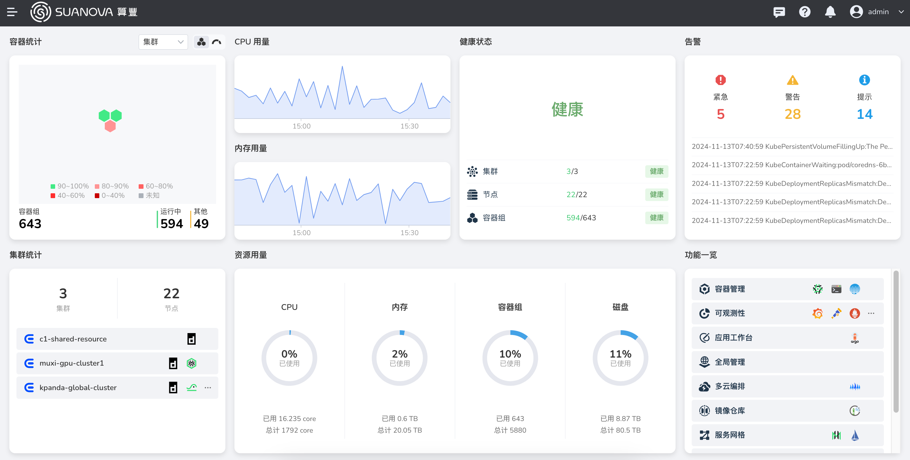

---
hide:
  - toc
---

# 算丰 AI 算力平台 - 管理员

这是算丰 AI 算力平台面向管理员的运维文档。

- :octicons-fiscal-host-16:{ .lg .middle } __云主机__

    ---

    云主机是部署在云端的虚拟机。

    - [管理云主机](./virtnest/vm/create-secret.md)
    - [云主机 vGPU](./virtnest/gpu/vm-vgpu.md)
    - [云主机模板](./virtnest/template/index.md)
    - [从 VMWare 导入云主机](./virtnest/best-practice/import-ubuntu.md)

- :simple-kubernetes:{ .lg .middle } __容器管理__

    ---

    管理 K8s 集群、节点、应用、资源和权限。

    - [创建集群](k8s/create-k8s.md)
    - [添加工作节点](k8s/add-node.md)
    - [管理 Helm 应用](./kpanda/helm/README.md)
    - [HPA 水平扩缩容](./kpanda/scale/create-hpa.md)

- :simple-smart:{ .lg .middle } __算法开发__

    ---

    管理 AI 资源和队列。

    - [管理资源](./baize/oam/resource.md)
    - [管理队列](./baize/oam/queue/create.md)
    - [AI 训推最佳实践](./baize/best-practice/deploy-nfs-in-worker.md)
    - [算法开发故障排查](./baize/troubleshoot/index.md)

- :fontawesome-solid-diagram-project:{ .lg .middle } __可观测性__

    ---

    了解可观测性资源，配置和故障排查。

    - [部署资源规划](./insight/quickstart/res-plan/prometheus-res.md)
    - [安装与升级](./insight/quickstart/install/index.md)
    - [兼容性测试](./insight/compati-test/k8s-compatibility.md)
    - [常见问题](./insight/faq/traceclockskew.md)

- :fontawesome-solid-user:{ .lg .middle } __全局管理__

    ---

    管控用户、用户组、工作空间、资源等访问权限。

    - [绑定工作空间](register/bindws.md)
    - [为工作空间分配资源](register/wsres.md)
    - [审计日志](./ghippo/audit/open-audit.md)
    - [平台设置](./ghippo/platform-setting/security.md)

