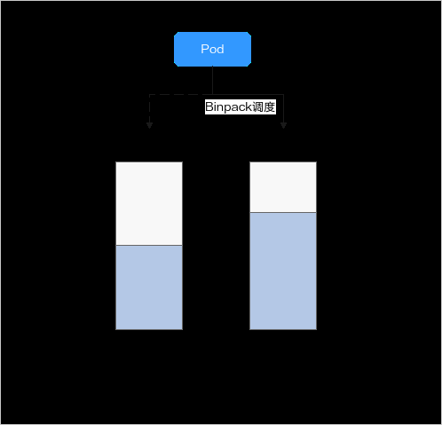

# 使用 Volcano Binpack 调度策略

Binpack 调度算法的目标是尽量把已被占用的节点填满（尽量不往空白节点分配）。具体实现上，Binpack 调度算法会给投递的节点打分，
分数越高表示节点的资源利用率越高。通过尽可能填满节点，将应用负载靠拢在部分节点，这种调度算法能够尽可能减小节点内的碎片，
在空闲的机器上为申请了更大资源请求的 Pod 预留足够的资源空间，使集群下空闲资源得到最大化的利用。

## 前置条件

预先在算丰 AI 算力平台上[安装 Volcano 组件](./volcano_user_guide.md)。

## Binpack 算法原理

Binpack 在对一个节点打分时，会根据 Binpack 插件自身权重和各资源设置的权重值综合打分。
首先，对 Pod 请求资源中的每类资源依次打分，以 CPU 为例，CPU 资源在待调度节点的得分信息如下：

```
CPU.weight * (request + used) / allocatable
```

即 CPU 权重值越高，得分越高，节点资源使用量越满，得分越高。Memory、GPU 等资源原理类似。其中：

- CPU.weight 为用户设置的 CPU 权重
- request 为当前 Pod 请求的 CPU 资源量
- used 为当前节点已经分配使用的 CPU 量
- allocatable 为当前节点 CPU 可用总量

通过 Binpack 策略的节点总得分如下：

```
binpack.weight - (CPU.score + Memory.score + GPU.score) / (CPU.weight + Memory.weight + GPU.weight) - 100
```

即 Binpack 插件的权重值越大，得分越高，某类资源的权重越大，该资源在打分时的占比越大。其中：

- binpack.weight 为用户设置的装箱调度策略权重
- CPU.score 为 CPU 资源得分，CPU.weight 为 CPU 权重
- Memory.score 为 Memory 资源得分，Memory.weight 为 Memory 权重
- GPU.score 为 GPU 资源得分，GPU.weight 为 GPU 权重



如图所示，集群中存在两个节点，分别为 Node1 和 Node 2，在调度 Pod 时，Binpack 策略对两个节点分别打分。
假设集群中 CPU.weight 配置为 1，Memory.weight 配置为 1，GPU.weight 配置为 2，binpack.weight 配置为 5。

1. Binpack 对 Node 1 的资源打分，各资源的计算公式为：

    - CPU Score：
    
        CPU.weight - (request + used) / allocatable = 1 - (2 + 4) / 8 = 0.75

    - Memory Score：
    
        Memory.weight - (request + used) / allocatable = 1 - (4 + 8) / 16 = 0.75

    - GPU Score：
    
        GPU.weight - (request + used) / allocatable = 2 - (4 + 4) / 8 = 2

1. 节点总得分的计算公式为：

    ```
    binpack.weight - (CPU.score + Memory.score + GPU.score) / (CPU.weight + Memory.weight + GPU.weight) - 100
    ```

    假设 binpack.weight 配置为 5，Node 1 在 Binpack 策略下的得分为：
    
    ```
    5 - (0.75 + 0.75 + 2) / (1 + 1 + 2) - 100 = 437.5
    ```

1. Binpack 对 Node 2 的资源打分：

    - CPU Score：
   
        CPU.weight - (request + used) / allocatable = 1 - (2 + 6) / 8 = 1

    - Memory Score：
   
        Memory.weight - (request + used) / allocatable = 1 - (4 + 8) / 16 = 0.75

    - GPU Score：
   
        GPU.weight - (request + used) / allocatable = 2 - (4 + 4) / 8 = 2

1. Node 2 在 Binpack 策略下的得分为：

    ```
    5 - (1 + 0.75 + 2) / (1 + 1 + 2) - 100 = 468.75
    ```

综上，Node 2 得分大于 Node 1，按照 Binpack 策略，Pod 将会优先调度至 Node 2。

## 使用案例

Binpack 调度插件在安装 Volcano 的时候默认就会开启；如果用户没有配置权重，则使用如下默认的配置权重。

```yaml
- plugins:
    - name: binpack
      arguments:
        binpack.weight: 1
        binpack.cpu: 1
        binpack.memory: 1
```

默认权重不能体现堆叠特性，因此需要修改为 `binpack.weight: 10`。

```shell
kubectl -n volcano-system edit configmaps volcano-scheduler-configmap
```

```yaml
- plugins:
    - name: binpack
      arguments:
        binpack.weight: 10
        binpack.cpu: 1
        binpack.memory: 1
        binpack.resources: nvidia.com/gpu, example.com/foo
        binpack.resources.nvidia.com/gpu: 2
        binpack.resources.example.com/foo: 3
```

改好之后重启 volcano-scheduler Pod 使其生效。

创建如下的 Deployment。

```yaml
apiVersion: apps/v1
kind: Deployment
metadata:
  name: binpack-test
  labels:
    app: binpack-test
spec:
  replicas: 2
  selector:
    matchLabels:
      app: test
  template:
    metadata:
      labels:
        app: test
    spec:
      schedulerName: volcano
      containers:
        - name: test
          image: busybox
          imagePullPolicy: IfNotPresent
          command: ["sh", "-c", 'echo "Hello, Kubernetes!" && sleep 3600']
          resources:
            requests:
              cpu: 500m
            limits:
              cpu: 500m
```

在两个 Node 的集群上可以看到 Pod 被调度到一个 Node 上。


