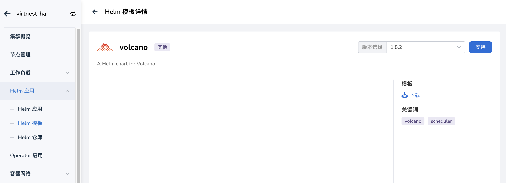
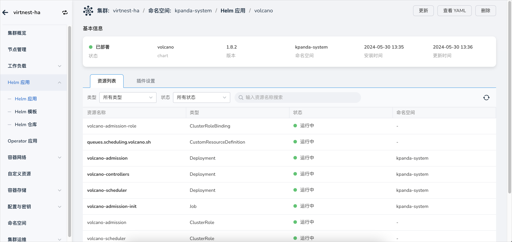

# 安装 Volcano

随着 Kubernetes（K8s）成为云原生应用编排与管理的首选平台，众多应用正积极向 K8s 迁移。
在人工智能与机器学习领域，由于这些任务通常涉及大量计算，开发者倾向于在 Kubernetes 上构建 AI 平台，
以充分利用其在资源管理、应用编排及运维监控方面的优势。

然而，Kubernetes 的默认调度器主要针对长期运行的服务设计，对于 AI、大数据等需要批量和弹性调度的任务存在诸多不足。
例如，在资源竞争激烈的情况下，默认调度器可能导致资源分配不均，进而影响任务的正常执行。

以 TensorFlow 作业为例，其包含 PS（参数服务器）和 Worker 两种角色，两者需协同工作才能完成任务。
若仅部署单一角色，作业将无法运行。而默认调度器对 Pod 的调度是逐个进行的，无法感知 TFJob 中 PS 和 Worker 的依赖关系。
在高负载情况下，这可能导致多个作业各自分配到部分资源，但均无法完成，从而造成资源浪费。

## Volcano 的调度策略优势

Volcano 提供了多种调度策略，以应对上述挑战。其中，Gang-scheduling 策略能确保分布式机器学习训练过程中多个任务（Pod）同时启动，
避免死锁；Preemption scheduling 策略则允许高优先级作业在资源不足时抢占低优先级作业的资源，确保关键任务优先完成。

此外，Volcano 与 Spark、TensorFlow、PyTorch 等主流计算框架无缝对接，并支持 CPU 和 GPU 等异构设备的混合调度，为 AI 计算任务提供了全面的优化支持。

接下来，我们将介绍如何安装和使用 Volcano，以便您能够充分利用其调度策略优势，优化 AI 计算任务。

## 安装 Volcano

1. 在 **集群详情** -> **Helm 应用** -> **Helm 模板** 中找到 Volcano 并安装。

    
   
    

2. 检查并确认 Volcano 是否安装完成，即 volcano-admission、volcano-controllers、volcano-scheduler 组件是否正常运行。

    

通常 Volcano 会和 AI Lab 平台配合使用，以实现数据集、Notebook、任务训练的整个开发、训练流程的有效闭环。
