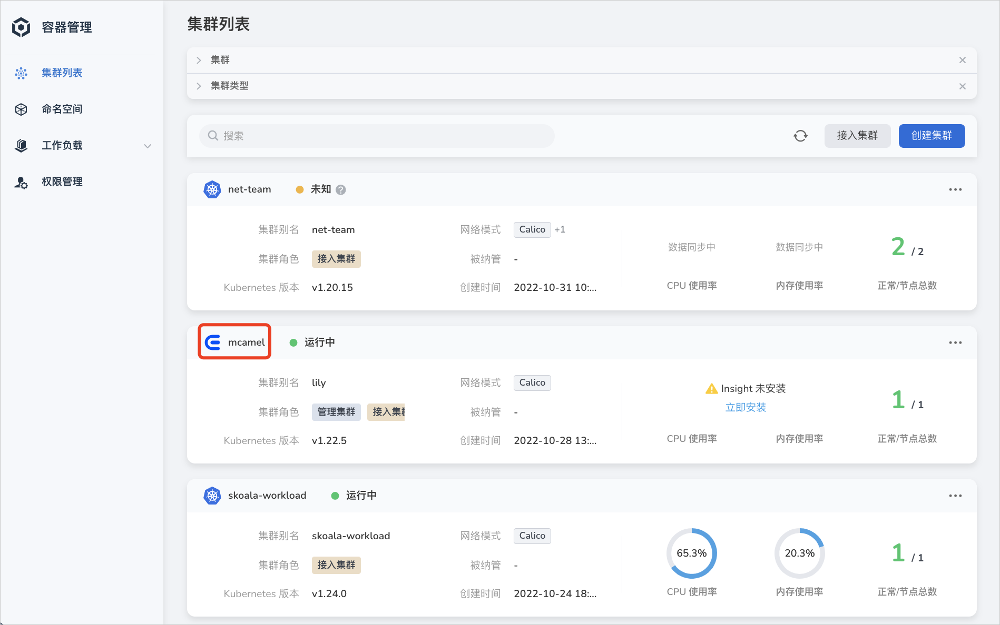
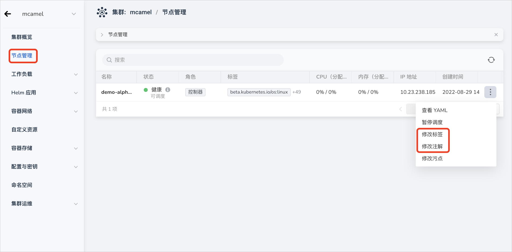

---
hide:
  - toc
---

# 标签与注解

标签（Labels）是为 Pod、节点、集群等 Kubernetes 对象添加的标识性键值对，可结合标签选择器查找并筛选满足某些条件的 Kubernetes 对象。每个键对于给定对象必须是唯一的。

注解（Annotations）和标签一样，也是键/值对，但不具备标识或筛选功能。
使用注解可以为节点添加任意的元数据。
注解的键通常使用的格式为 __前缀（可选）/名称（必填）__ ，例如 __nfd.node.kubernetes.io/extended-resources__ 。
如果省略前缀，表示该注解键是用户私有的。

有关标签和注解的更多信息，可参考 Kubernetes 的官方文档[标签和选择算符](https://kubernetes.io/zh-cn/docs/concepts/overview/working-with-objects/labels/)或[注解](https://kubernetes.io/zh-cn/docs/concepts/overview/working-with-objects/annotations/)。

添加/删除标签与注解的步骤如下：

1. 在 __集群列表__ 页面点击目标集群的名称。

    

2. 在左侧导航栏点击 __节点管理__ ，在节点右侧点击 __┇__ 操作图标，点击 __修改标签__ 或 __修改注解__ 。

    

3. 点击 __➕ 添加__ 可以添加标签或注解，点击 __X__ 可以删除标签或注解，最后点击 __确定__ 。

    
