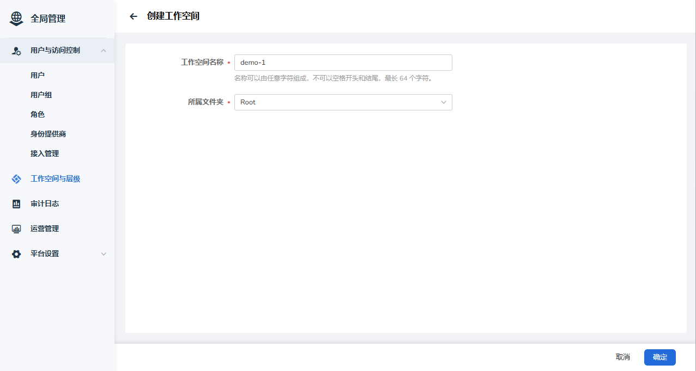
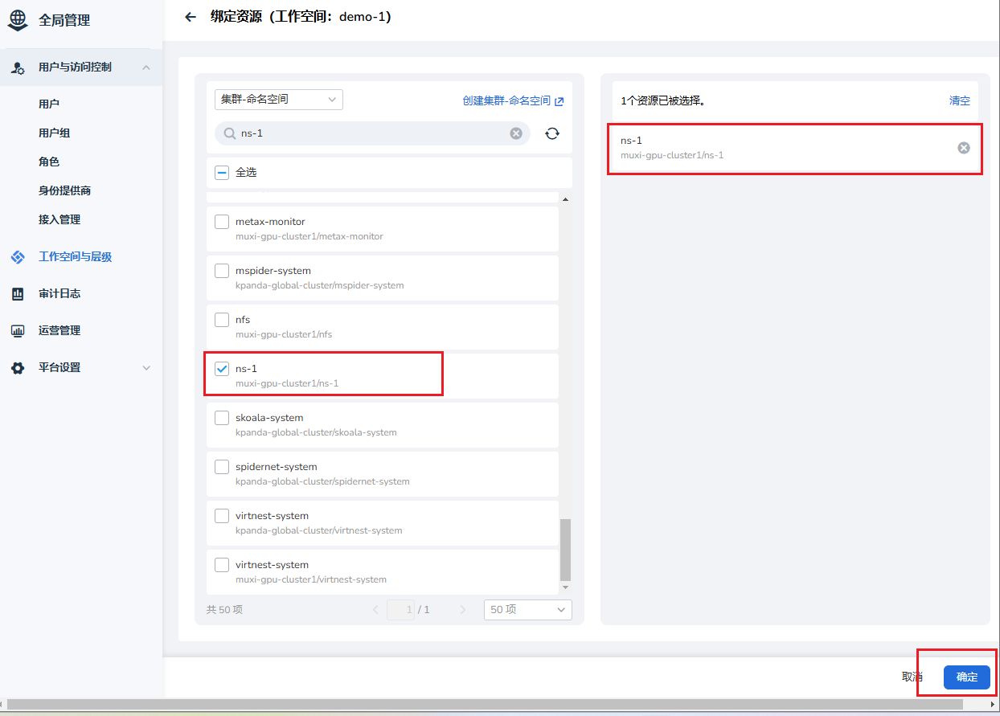
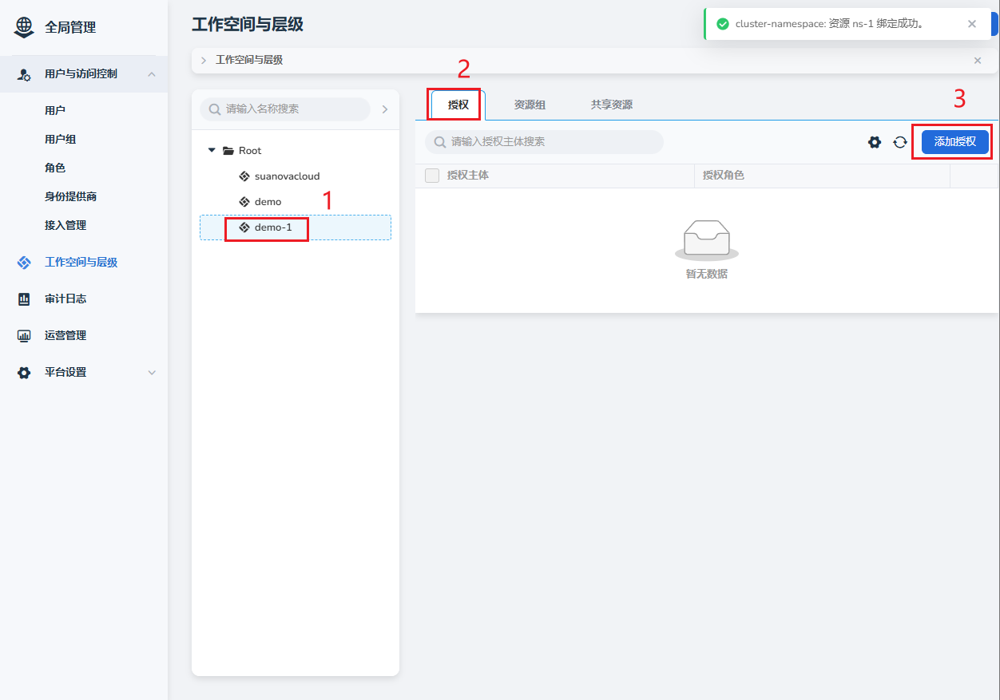
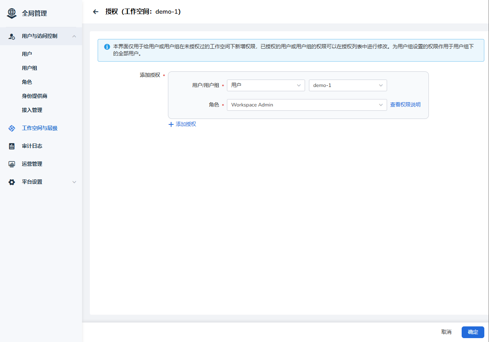

# 为用户绑定工作空间

用户成功注册之后，需要为其绑定一个工作空间。

## 前置条件

- 已安装 AI 算力平台
- [用户已成功注册](index.md)
- 有一个可用的管理员账号

## 操作步骤

1. 以管理员身份登录 AI 算力平台
1. 导航切换至 **全局管理** -> **工作空间与层级** ，点击 **创建工作空间**

    

1. 输入名称，选择文件夹后点击 **确定** ，创建一个工作空间

    

1. 给工作空间绑定资源

    

    可以在这个界面上点击 **创建集群-命名空间** 来创建一个命名空间。

1. 添加授权：将用户分配至工作空间

    
    

1. 用户登录 AI 算力平台，查看是否具有工作空间及命名空间的权限。
   管理员可以通过右侧的 **┇** 执行更多操作。

    

下一步：[为工作空间分配资源](./wsres.md)
