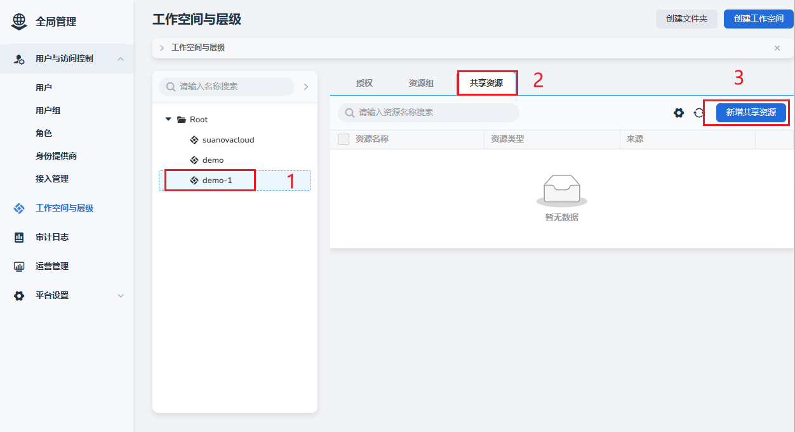
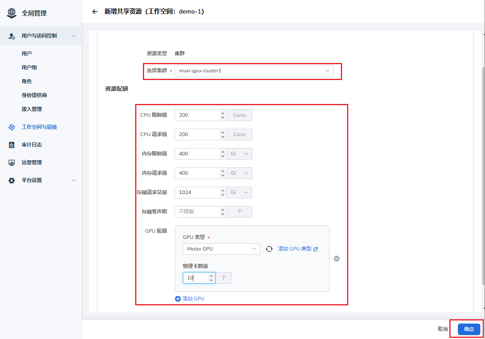
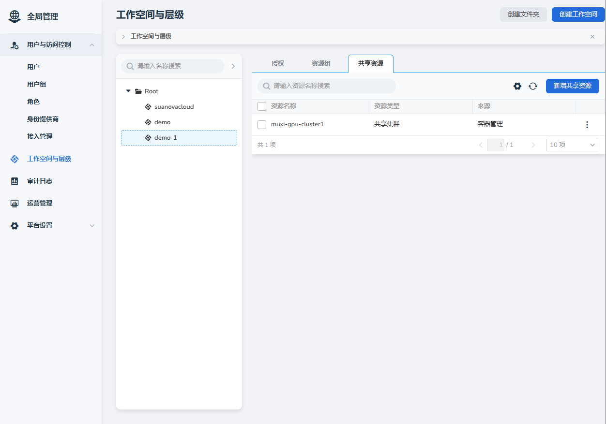

# 为工作空间分配资源

将[用户绑定到工作空间](./bindws.md)后，需要给工作空间分配合适的资源。

## 前置条件

- 已安装 AI 算力平台
- 有一个可用的管理员账号
- 工作空间已创建且绑定了命名空间

## 操作步骤

1. 以管理员身份登录 AI 算力平台
1. 导航到 **全局管理** -> **工作空间与层级**，找到要添加资源的工作空间，点击 **新增共享资源**

    

1. 选择集群，设置合适的资源配额后，点击 **确定**  <a id="quota" />

    

1. 返回共享资源页，为工作空间成功分配了资源，管理员可以通过右侧的 **┇** 随时修改。

    

下一步：[创建云主机](../host/createhost.md)
