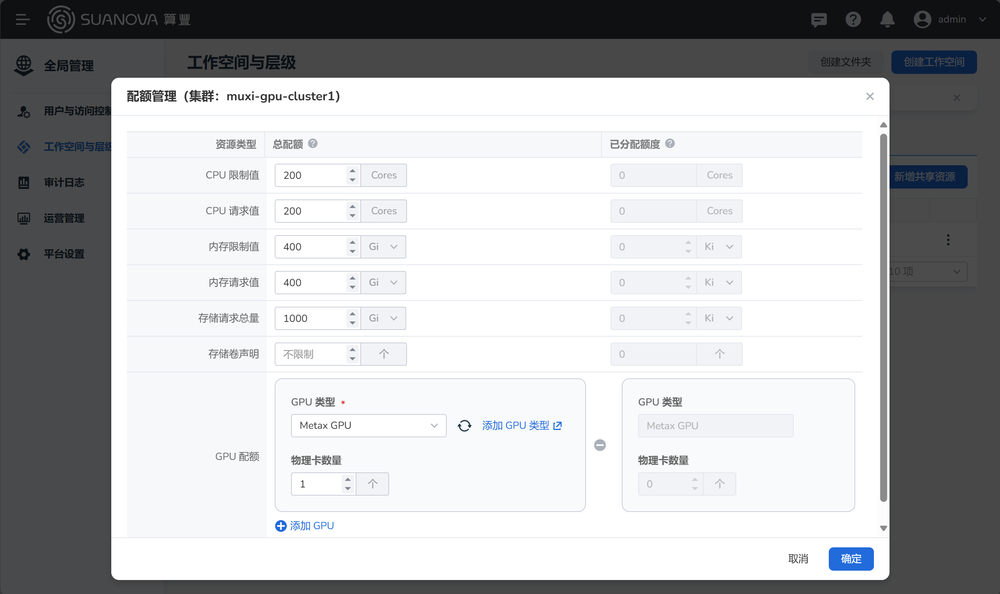
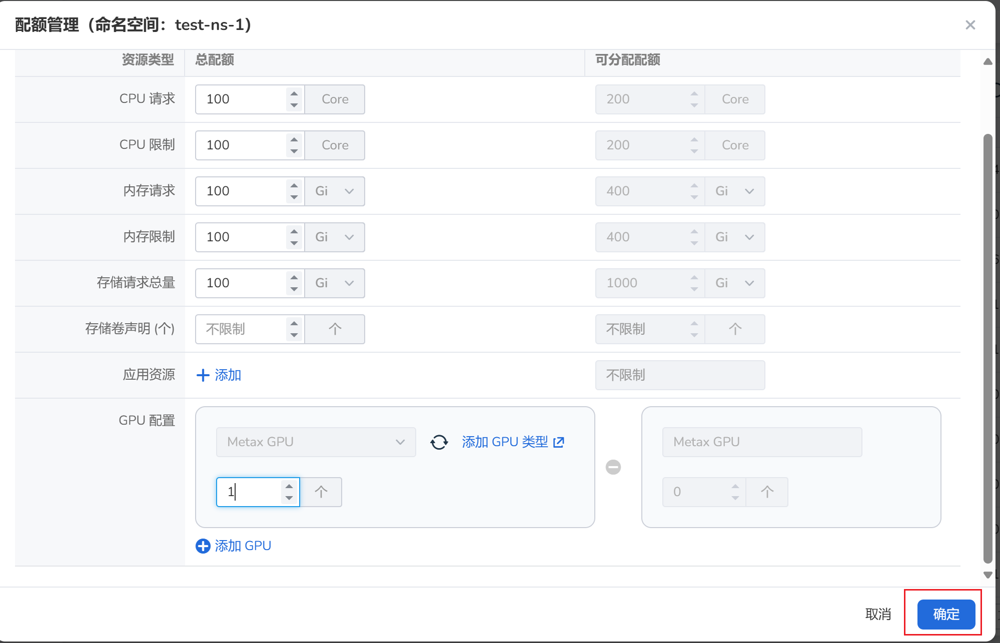
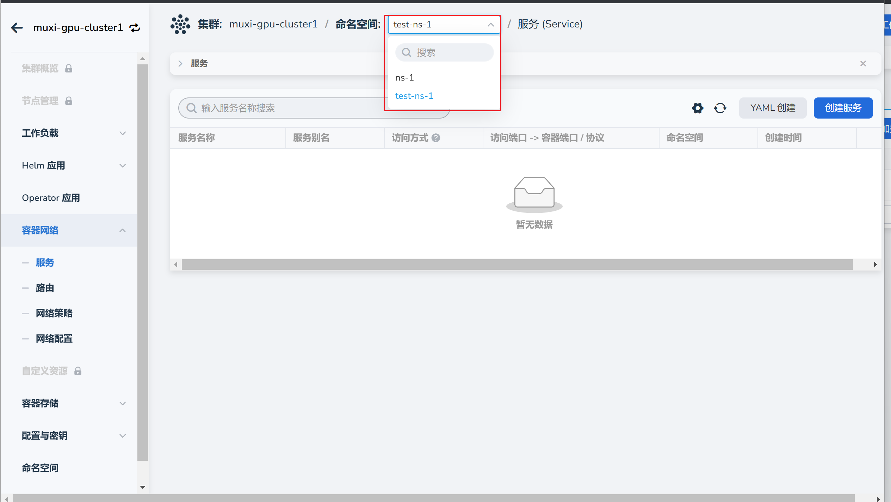

# 配额管理

用户被绑定到工作空间后，即可为工作空间分配资源，管理资源配额。

## 前置条件

- 已安装 AI 算力平台
- 有一个可用的管理员账号

## 创建和管理配额

1. 以 **管理员身份** 登录 AI 算力平台
1. [创建工作空间和命名空间，并绑定用户](../register/bindws.md)
1. [为工作空间分配资源配额](../register/wsres.md#quota)

    

1. 管理命名空间 `test-ns-1` 的资源配额，其数值不能超过工作空间的配额。

    

1. 以 **用户身份** 登录 AI 算力平台，查看其是否被分配了 `test-ns-1` 命名空间。

    

下一步：[创建 AI 负载使用 GPU 资源](./workload.md)
