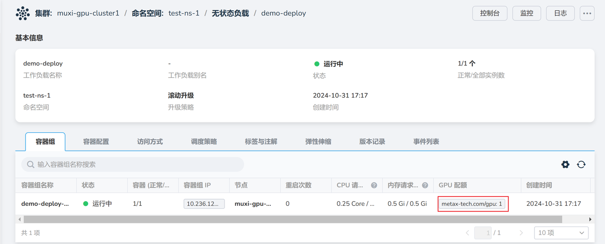

# 创建 AI 负载使用 GPU 资源

管理员为工作空间分配资源配额后，用户就可以创建 AI 工作负载来使用 GPU 算力资源。

## 前置条件

- 已安装 AI 算力平台
- [用户已成功注册](../register/index.md)
- [管理员为用户分配了工作空间](../register/bindws.md)
- [为工作空间设置了资源配额](./quota.md)
- [已经创建了一个集群](../k8s/create-k8s.md)

## 创建 AI 负载步骤

1. 以用户身份登录 AI 算力平台
1. 导航至 **容器管理** ，选择一个命名空间，点击 **工作负载** -> **无状态负载** ，
   点击右侧的 **镜像创建** 按钮

    

1. 配置各项参数后点击 **确定**

    === "基本信息"

        选择自己的命名空间。

        

    === "容器配置"

        设置镜像，配置 CPU、内存、GPU 等资源，设置启动命令。

        

    === "其他"

        服务配置和高级配置可以使用默认配置。

1. 自动返回无状态负载列表，点击负载名称

    

1. 进入详情页，可以看到 GPU 配额

    

1. 你还可以进入控制台，运行 `mx-smi` 命令查看 GPU 资源

    

下一步：[使用 Notebook](./notebook.md)
