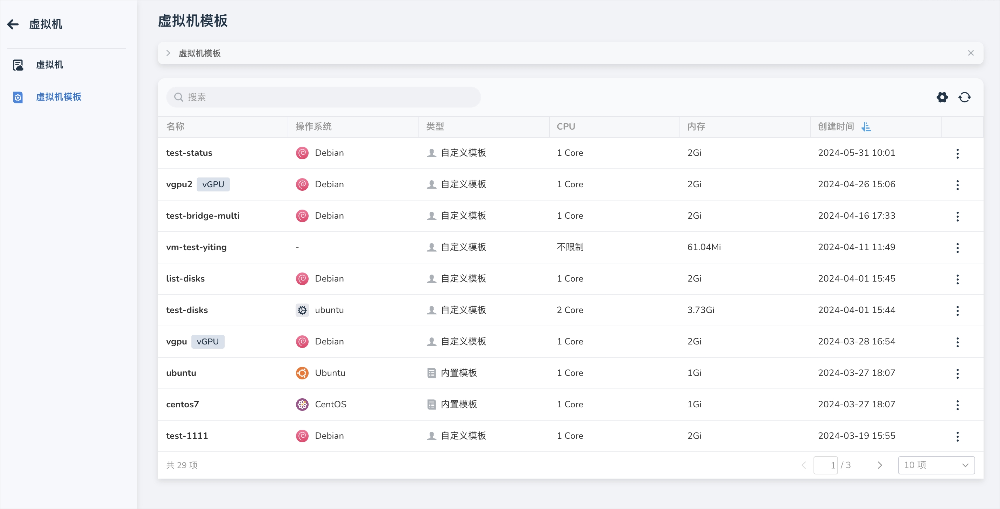
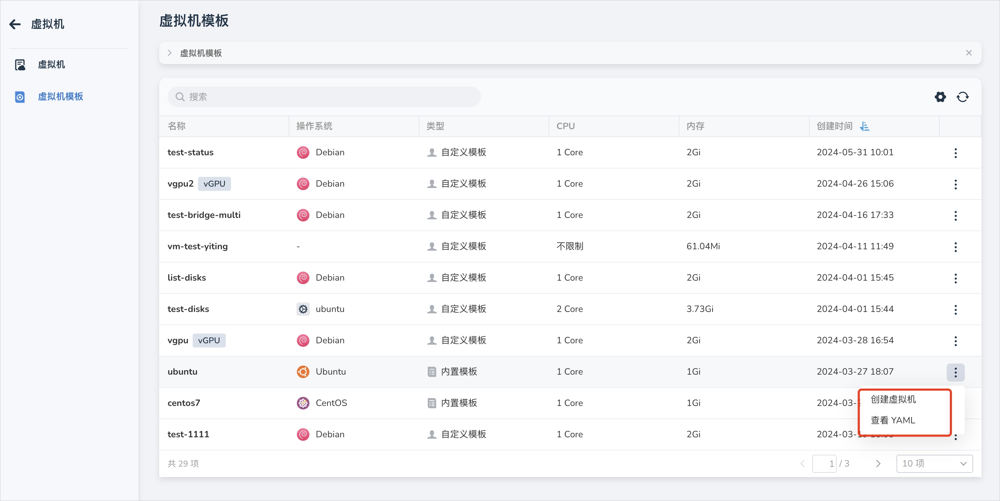
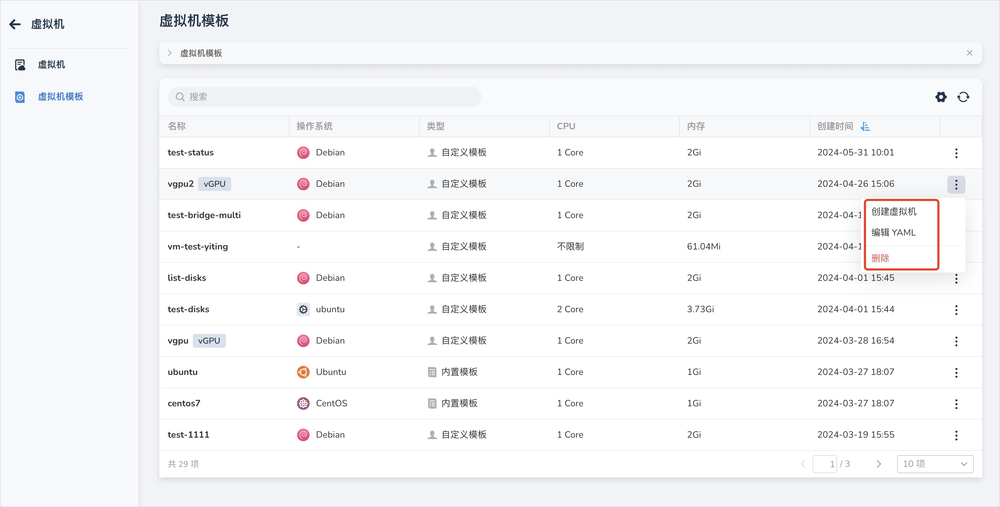
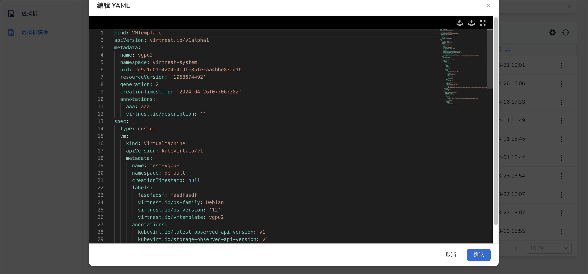
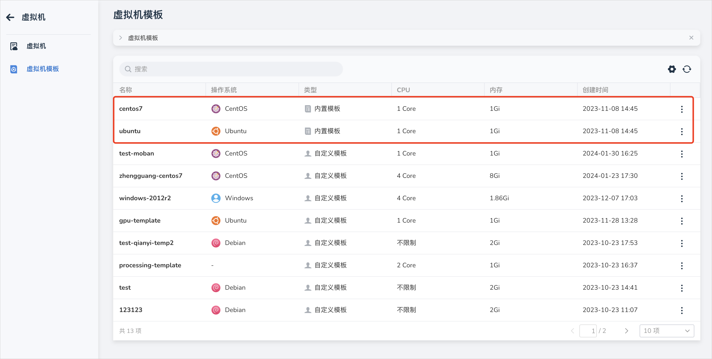
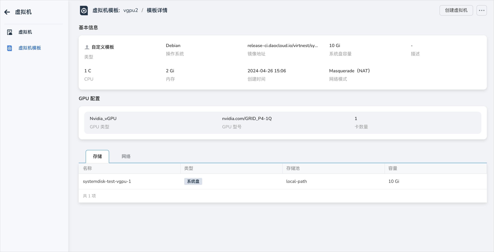

# 云主机模板

本文将介绍内置云主机模板和自定义云主机模板。

通过内置模板和自定义模板，用户可以轻松创建新的云主机。此外，我们还提供将现有云主机转换为云主机模板的功能，让用户能够更加灵活地管理和使用资源。

## 云主机模板

1. 点击左侧导航栏上的 __容器管理__ ，然后点击 __云主机模板__ ，进入 __云主机模板__ 页面，若该模板是由配置了 GPU 的云主机转换而来，模板也会带有 GPU 的信息，将在模板列表中展示。

    

2. 点击列表右侧的 __┇__ ，可以对内置模板执行创建云主机和查看 YAML 操作；对自定义模板支持创建云主机、编辑 YAML 和删除操作。

    

    

    

### 内置模板

- 平台内内置两种模板，分别是 CentOS 和 Ubuntu。

    

### 自定义模板

自定义模板是由云主机配置转化而来的模板。以下介绍如何从云主机配置转换为模板。

1. 点击左侧导航栏上的 __容器管理__ ，然后点击 __云主机__ ，进入列表页面，点击列表右侧的 __┇__ 支持将配置转换为模板。只有运行中/关闭状态下的云主机支持转化。

2. 填写新模板的名称，提示原始云主机将会保留并且可用。转换成功后，将会在模板列表新增一条数据。

### 模板详情

成功创建出来一个模板后，点击模板名称，可以查看云主机详情，包括基本信息、GPU 信息、存储、网络等。如果需要快速基于该模板部署新的云主机，只需点击页面右上角的 __创建云主机__ 按钮即可便捷操作。

