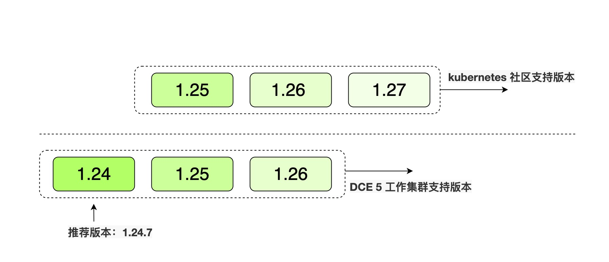

# 集群版本支持范围

在算丰 AI 算力平台中，[接入型集群](cluster-status.md)和[自建集群](cluster-status.md)采取不同的版本支持机制。

本文主要介绍自建集群的版本支持机制。

Kubernetes 社区支持 3 个版本范围，如 1.26、1.27、1.28。当社区新版本发布之后，支持的版本范围将会进行递增。
如社区最新的 1.29 版本已经发布，此时社区支持的版本范围是 1.27、1.28、1.29。

例如，社区支持的版本范围是 1.25、1.26、1.27，则在算丰 AI 算力平台中使用界面创建工作集群的版本范围是 1.24、1.25、1.26，并且会为用户推荐一个稳定的版本，如 1.24.7。

除此之外，算丰 AI 算力平台中使用界面创建工作集群的版本范围与社区保持高度同步，当社区版本进行递增后，算丰 AI 算力平台中使用界面创建工作集群的版本范围也会同步递增一个版本。

## Kubernetes 版本支持范围

<table>
  <thead>
    <tr>
      <th>Kubernetes 社区版本范围</th>
      <th>自建工作集群版本范围</th>
      <th>自建工作集群推荐版本</th>
      <th>算丰 AI 算力平台安装器</th>
      <th>发布时间</th>
    </tr>
  </thead>
  <tbody>
    <tr>
      <td>
        <ul>
          <li>1.26</li>
          <li>1.27</li>
          <li>1.28</li>
        </ul>
      </td>
      <td>
        <ul>
          <li>1.25</li>
          <li>1.26</li>
          <li>1.27</li>
        </ul>
      </td>
      <td><strong>1.27.5</strong></td>
      <td>v0.13.0</td>
      <td>2023.11.30</td>
    </tr>
  </tbody>
</table>

