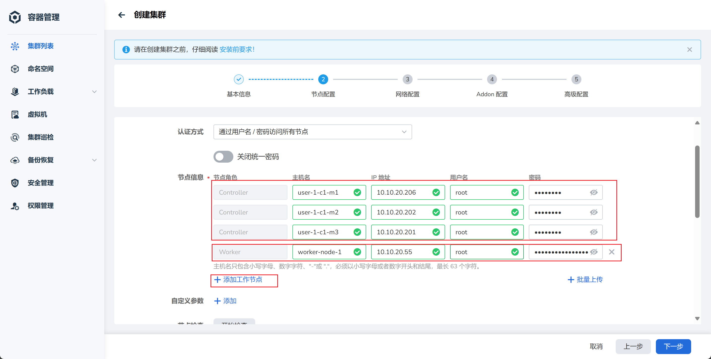

# 创建云上 Kubernetes 集群

部署 Kubernetes 集群是为了支持高效的 AI 算力调度和管理，实现弹性伸缩，提供高可用性，从而优化模型训练和推理过程。

## 前置条件

- 已安装 AI 算力平台已
- 有一个管理员权限的账号
- 准备一台带 GPU 的物理机
- 分配两段 IP 地址（Pod CIDR 18 位、SVC CIDR 18 位，不能与现有网段冲突）

## 创建步骤

1. 以 **管理员身份** 登录 AI 算力平台
1. [创建并启动 3 台不带 GPU 的云主机](../host/createhost.md)用作集群的 Master 节点

    - 配置资源，CPU 16 核，内存 32 GB，系统盘 200 GB（ReadWriteOnce）
    - 网络模式选择 **Bridge（桥接）**
    - 设置 root 密码或添加 SSH 公钥，方便以 SSH 连接
    - 记录好 3 台主机的 IP

1. 导航至 **容器管理** -> **集群列表** ，点击右侧的 **创建集群** 按钮
1. 按照向导，配置集群的各项参数

    === "基本信息"

        

    === "节点配置"

        配置完节点信息后，点击 **开始检查** ，

        
        

    === "网络配置"

        

    === "Addon 配置"

        

    === "高级配置"

        每个节点默认可运行 110 个 Pod（容器组），如果节点配置比较高，可以调整到 200 或 300 个 Pod。

        

1. 等待集群创建完成。

    

1. 在集群列表中，找到刚创建的集群，点击集群名称，导航到 **Helm 应用** -> **Helm 模板** ，在搜索框内搜索 metax-gpu-extensions，点击卡片

    

    

1. 点击右侧的 **安装** 按钮，开始安装 GPU 插件

    === "应用设置"

        输入名称，选择命名空间，在 YAMl 中修改镜像地址：

        

    === "Kubernetes 编排确认"

        

1. 自动返回 Helm 应用列表，等待 metax-gpu-extensions 状态变为 **已部署**

    

1. 到此集群创建成功，可以去查看集群所包含的节点。你可以去[创建 AI 工作负载并使用 GPU 了](../share/workload.md)。

    

下一步：[创建 AI 工作负载](../share/workload.md)
